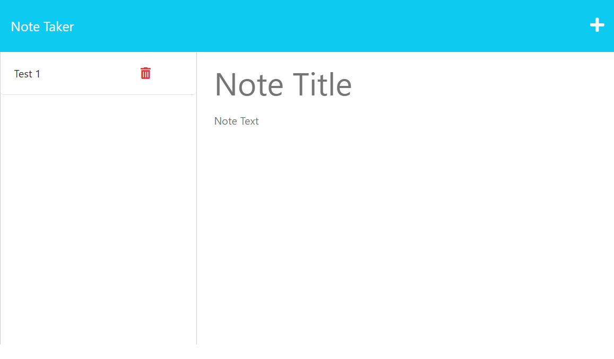

# 11 Note Taker

## Table of Contents
1. [Description](#desc)
2. [Installation](#install)
3. [Usage](#usage)
4. [Demo](#demo)
5. [License](#license)

## Description 
Create an application that can be used to write and save notes using ExpressJS.

 
## Installation

Install Node modules using `npm i`.

 
## Usage

1. Initiate localhost by entering `nodemon server.js` or `nodemon .` from root directory.
2. Click "Get Started" to begin Note Taker app.
3. Click plus ("+") symbol in upper right hand corner to create a new note.
4. A floppy disk icon will appear next to the plus sign once a title and text have been entered.
5. Click floppy disk icon to save your note.
6. Select a note from left panel to view.
7. Click trash icon next to note title to delete item.

 
## Demo
[Click here](https://young-brushlands-59716.herokuapp.com/) to access the application in production.

Here's a [video](https://youtu.be/OROMidWa0aU) of the application in use.

 
## License
All code is released under the [GNU General Public License](https://www.gnu.org/licenses/gpl-3.0.en.html).